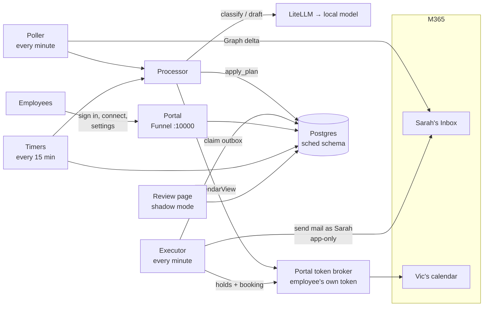

# Sarah — BZB's AI scheduling assistant

Vic CCs `sarah.johnson@bluzonebio.com` on an email ("Sarah will find us a time"). Sarah then does the rest:

- moves Vic to BCC and offers the client three times that fit Vic's calendar
- handles the back-and-forth
- asks Vic to confirm the time the client picks
- books it on Vic's calendar, so the invite comes from Vic
- confirms with the client

Sarah never sends from Vic's address. When something needs a person, she hands the thread back to Vic and stops.

It runs on BZB-AI-1:

- **n8n** orchestrates.
- **Microsoft Graph** handles mail and calendars. Mail is app-only, and Exchange limits the app to Sarah's mailbox. Each employee's calendar is reached with **their own delegated token**, held by the portal.
- **The portal** (`portal/`, public through Tailscale Funnel) is where employees sign in with Microsoft 365, connect their calendar and set their preferences. Its internal token broker makes the calendar calls for n8n.
- **LiteLLM** routes to the local model, which classifies replies and writes the wording.
- **Postgres** holds all state.



## Design rule: the model writes words, code controls facts

The model does two narrow jobs:

1. It classifies an email into a fixed JSON shape.
2. It writes the wording of a client email, using `{{SLOTS}}` / `{{TIME}}` placeholders instead of any date or time.

Code does everything else: which times are free, who gets emailed, what gets booked, and when to escalate. Every draft is checked before it can be sent. A draft that mentions a date, time, timezone, link, email address, or phone number is discarded and replaced with a fixed template. See [docs/01-architecture.md](docs/01-architecture.md).

## Repository

| Path | What |
|---|---|
| `m365/exchange-setup.ps1` | Shared mailbox + app scoped to Sarah's mailbox only, with RBAC for Applications. Calendars come through the portal |
| `db/001_schema.sql` `002_functions.sql` `003_seed.sql` | Postgres schema, the functions the workflows call, config + Vic's row |
| `db/004_portal.sql` | Upgrade in place: delegated calendars, pause/reconnect, the portal's tables and functions |
| `portal/` | The self-service portal and token broker (Node, server-rendered, MSAL). `deploy/compose.portal.yml` adds it to the stack |
| `src/` | All agent logic: routing, slot picking, prompts, draft validation, Graph request building |
| `n8n/workflows/*.json` | **Generated** from `src/` by `npm run build`. Import these; never hand-edit |
| `n8n/credentials.template.json` | The four n8n credentials, fixed IDs the workflows reference |
| `test/unit/` `portal/test/` `db/tests/` `test/e2e/` | Unit tests, portal tests, database tests, and an end-to-end suite that runs the real workflows in n8n against a mock Graph, LLM and token broker |
| `docs/` | Everything below |

## Setup, in order

| Step | Guide | Time |
|---|---|---|
| 1. Mailbox, app, scoping | [docs/02-m365-setup.md](docs/02-m365-setup.md) | ~1 h (mostly waiting on RBAC) |
| 2. Database | [docs/03-database.md](docs/03-database.md) | 15 min |
| 3. n8n: credentials, workflows, publish | [docs/04-n8n-setup.md](docs/04-n8n-setup.md) | 30 min |
| 4. Portal: Entra app, Funnel, deploy | [docs/09-portal.md](docs/09-portal.md) | ~1 h |
| 5. Rollout: `dry_run` → `shadow` → `live` | [docs/05-rollout.md](docs/05-rollout.md) | days, by design |
| The employee one-pager | [docs/vic-guide.md](docs/vic-guide.md) | — |
| Day-to-day operations | [docs/07-runbook.md](docs/07-runbook.md) | — |
| Why it's built this way | [docs/08-decisions.md](docs/08-decisions.md) | — |

It starts in mode `off`. Nothing reads or sends mail until you change that deliberately.

## Tests

```bash
npm install
npm test                 # 91 unit tests (slots, routing, decisions, validator, Graph requests) + 38 portal tests
npm run test:db          # 129 database tests (needs a Postgres; see docs/06-testing.md)
N8N_BIN=... npm run test:e2e       # real n8n + mock Graph/LLM/broker, 12 scenarios (docs/06-testing.md)
```

## What v1 does not do

- **Reschedules or cancellations.** Any client reply after booking goes to Vic.
- **Client timezones.** Every time is offered in Vic's timezone with the UTC offset spelled out. If a client proposes a time in another timezone, the thread goes to Vic.
- **Requests that don't CC Sarah.** If Vic forwards a request to Sarah or BCCs her, she won't act on it; she has to be on To or CC.
- **Picking up again after Vic takes over.** Once a thread is `NEEDS_VIC`, `STALLED` or `CLOSED`, Sarah stays out of it. Vic *can* start a new request in the same email thread once the earlier one is booked, closed or stalled ("Sarah, find us a follow-up time").
- **Rescheduling around a dead token.** If Sarah loses access to someone's calendar, threads that need it go back to that person (`NEEDS_VIC`); they don't resume after reconnecting (docs/08-decisions.md, D18).
