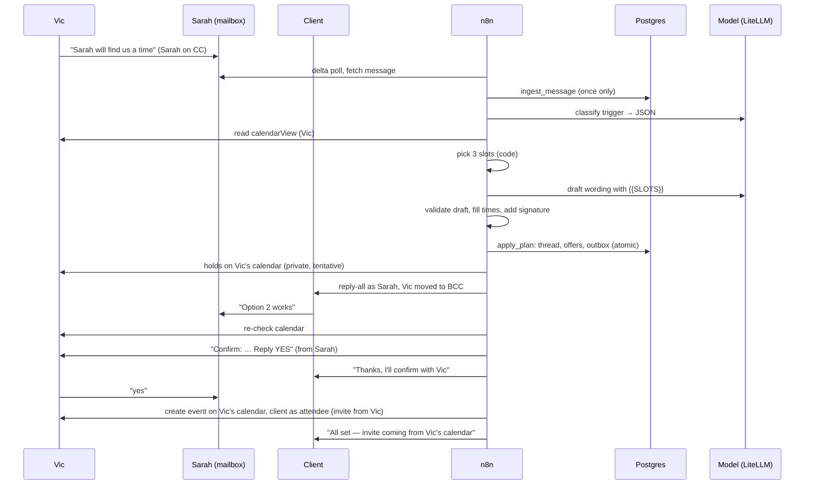
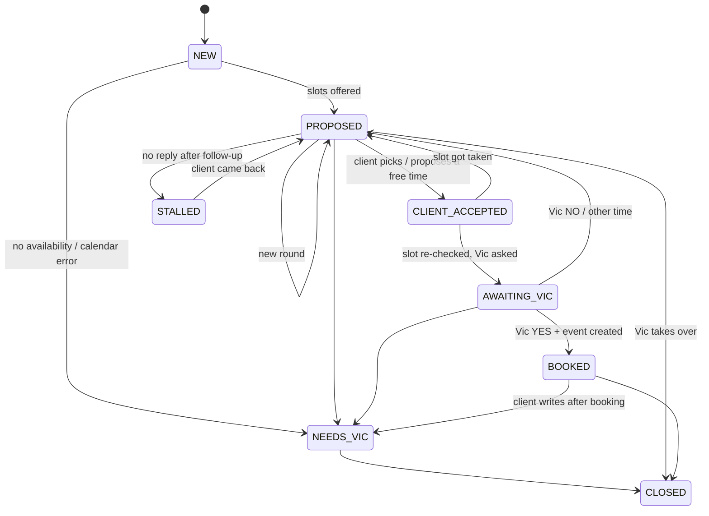

# Architecture

## Components

| Piece | Where | Job |
|---|---|---|
| Sarah's mailbox | Exchange Online, shared mailbox (no license) | The only address that ever sends. Clients and Vic write to it |
| App registration "BZB Scheduling Agent" | Entra + Exchange RBAC for Applications | App-only Graph token. Mail rights on Sarah's mailbox only. No calendar rights (optional temporary exception for Vic: `docs/02-m365-setup.md`) |
| App registration "BZB Sarah Portal" | Entra, assignment required ("Sarah users" group) | Delegated sign-in: each employee consents to Sarah using **their own** calendar |
| Portal + token broker | `sarah-portal` in the compose stack; UI public through Tailscale Funnel `:10000`, broker on the compose network only | Sign-in, calendar consent, settings, pause. The broker holds each employee's encrypted refresh token and makes their calendar calls for n8n (`docs/09-portal.md`) |
| n8n (6 workflows) | BZB-AI-1 compose stack | Scheduling, retries, HTTP calls, error alerts |
| `sched` schema | Postgres on BZB-AI-1 (own database + role) | All state, config, and invariants |
| LiteLLM → local model | BZB-AI-1 | Classifies emails; writes email wording |
| `src/` (JavaScript) | Inlined into n8n Code nodes at build time | Routing, slot picking, decisions, draft validation |

## Workflows

| Workflow | Trigger | Does |
|---|---|---|
| **Sarah · Poller** | every minute | Graph delta on Sarah's Inbox → fetch each new message → `ingest_message` (stores it exactly once) → Processor |
| **Sarah · Processor** | called per email / timer event | `load_context` → route → classify (LLM) → read the employee's calendar (app-only Graph, or the portal's broker for delegated employees) → decide → draft (LLM) → validate → `apply_plan` → kick Executor |
| **Sarah · Executor** | every minute + on demand | `outbox_claim` → Graph calls (mail always app-only; holds and bookings through the broker for delegated employees) → `outbox_report` |
| **Sarah · Timers** | every 15 min | `timer_events`: sweep stuck work, release holds, then follow-up / stall / reminder events → Processor |
| **Sarah · Review** | webhook (tailnet only) | Shadow mode approve/reject: GET shows a confirm button, only the POST acts |
| **Sarah · Errors** | any Sarah workflow fails | Emails the alert address from Sarah's mailbox |

## One email, end to end

## Thread states

A database trigger enforces this graph: an illegal transition aborts the whole plan, and every legal one is written to `sched.thread_events`. `NEEDS_VIC` requires an `escalation_reason`, `CLOSED` requires a `closed_reason`, and `BOOKED` requires a `booked_event_id`.

## The outbox and run modes

Nothing in the Processor talks to Graph except the read-only calendar lookup. Every side effect is written by `apply_plan` into `sched.outbox`, in the same transaction as the state change: emails, holds, bookings, hold releases. The Executor carries them out. This gives four properties:

- **State and side effects can't disagree.** If the plan fails (for example, an offer that would overlap another thread's), nothing is queued.
- **The run mode is enforced in one place:**

| `mode` | Poller | Processor | Executor |
|---|---|---|---|
| `off` | does nothing (the delta cursor waits, so nothing is lost) | — | does nothing |
| `dry_run` | reads + logs | decides + logs; outbox rows written as `skipped` | does nothing |
| `shadow` | ✓ | ✓ | holds and internal mail run; **anything to an external address, and every booking, waits for Casey's approval** (a draft is created in Sarah's Drafts, and a review email with approve/reject links goes to the alert address) |
| `live` | ✓ | ✓ | everything runs |

- **dry_run leaves nothing behind.** Switching to `shadow` or `live` closes every thread `dry_run` created and expires its offers.
- **Order is explicit.** `depends_on` makes the client's "you're booked" email and the hold release wait until the booking actually exists.
- **Retries are safe.** Graph 429/5xx and network errors are retried up to 3 times. A draft that was created but not sent is re-sent, not re-created. Events carry a `transactionId`, so a retried booking can't double-book. After the last attempt, the item fails, its dependents are cancelled, the thread goes to `NEEDS_VIC`, and Casey is alerted.

## Security model

| Threat | Control |
|---|---|
| Stolen app secret reads or sends from any mailbox | No Entra permissions at all. Exchange RBAC for Applications grants mail on Sarah's mailbox only (`m365/exchange-setup.ps1`), and no calendar rights. A stolen secret can't read Vic's mail, send as him, or touch any employee's calendar |
| Stolen employee tokens | Refresh tokens live only in `sched.portal_tokens`, AES-256-GCM encrypted with a key that's only in the portal's env, bound to the employee row. The broker never returns a token: n8n gets Graph's answer for one of three calendar operations on that employee's own calendar (`/me`), so tokens never reach n8n's execution logs. The portal's DB role can run its own functions and read no tables |
| The internet-facing portal | Assignment required in Entra plus tenant/home-tenant/member/domain checks, `__Host-` cookies, CSRF on every POST, strict CSP with no script, HSTS, rate-limited sign-in, URLs built only from `PORTAL_BASE_URL`, broker port never published (`docs/09-portal.md` §4) |
| Anyone who emails Sarah drives Vic's calendar | Only an **enrolled employee** can start a thread, and only with `X-MS-Exchange-Organization-AuthAs: Internal` (Exchange-authenticated internal mail). A spoofed "Vic" email is ignored, and Casey gets an alert. External senders can only continue threads that already exist |
| Prompt injection in a client email | The model's output is a fixed JSON classification. It can't add recipients, choose times, or trigger actions. Recipients come from message headers and the thread record. Every outbound list is checked against the thread's allowed people, and a mismatch throws. Client display names are reduced to letters/spaces (60 chars) before they're stored, and are kept out of the prompt that classifies Vic's YES/NO |
| Internal notes reaching the client | Sarah replies to (and so quotes) only the newest email **from a client**, or Vic's original trigger. Never Vic's private reply, a colleague's note, an auto-reply, or the confirmation thread |
| Model invents a time, a link, or a promise | Drafts are rejected on any date / weekday / clock time / timezone / relative date / URL / email / phone. Placeholders are checked exactly, and the template is used instead |
| Model impersonates a person | The display name and signature carry "(AI)". The validator rejects "I'm a person"-style claims |
| Email link scanners approving shadow items | Review links only show a confirm page. Only a POST acts, the token is 256-bit and single-use, and the webhook is tailnet-only |
| Double processing / double booking | `internet_message_id` is unique. Once processing starts, a message is never processed again. Live offers can't overlap across threads (Postgres exclusion constraint). Bookings are idempotent (`transactionId`), and a second YES while a booking is queued is ignored |
| Two decisions racing on one thread (an email and a timer) | Every plan carries the thread's `plan_version`. `apply_plan` refuses a stale one and puts the email back; the timers re-dispatch it and it's decided again on fresh state. Timers skip a thread while one of its emails is undecided |
| Queued work outliving a hand-off | Escalating or closing a thread cancels its queued client emails and bookings (and their dependents). A booking that completes anyway is kept, the thread isn't marked `BOOKED`, and Casey is alerted |
| Silent stalls | An email is attached to its thread as soon as processing starts. If processing crashes, the sweeper escalates that thread within 15 min, so the thread never runs on and later sends a follow-up to a client who already replied. Outbox items stuck executing are retried. Client-facing mail unsent after 24 h, including shadow drafts still unreviewed, is cancelled rather than sent late. Every system failure alerts Casey |
| Model unavailable | A trigger isn't guessed at ("Sarah, don't book anything yet" contains the same keywords). It's logged as `ignored_model_unavailable` and Casey is alerted. Client replies escalate to Vic. Drafts fall back to templates |

## Slot selection (code, `src/slots.js`)

**Hard rules.** A slot that breaks any of these is never offered:

- No overlap with busy, tentative or OOF events, or with another thread's live offers.
- A minimum gap of `hard_gap_min` on each side (`in_person_buffer_min` for in-person meetings).
- Within working hours, and at least `min_notice_hours` ahead.
- Fewer than `max_meetings_per_day` meetings that day.

**Soft preferences.** Each candidate starts at a score of 100, then:

| Condition | Penalty |
|---|---|
| Gap before < `preferred_gap_min` | −40 |
| Gap after < `preferred_gap_min` | −40 |
| Creates a run of 3+ meetings | −30 |
| Day already has 4+ meetings | −15 |
| Outside preferred hours | −10 |

**Where it looks.** The window starts today, or on the requested `earliest_date` if there is one (never inside `min_notice_hours`). It then runs `search_window_days`, plus `widen_window_days` if needed, from that start. So "3 weeks from today" or a client's "the week of the 26th" is searched in that week, and Vic's calendar is read across exactly the days the decision can use. A request that starts more than `max_horizon_days` out (default 90) goes to Vic with that reason; Sarah never quietly offers nearer dates instead. A specific time the client proposes is checked against the calendar for that day, and refused past the horizon the same way.

**Choosing the three.** Clean slots, one per day, mixing morning and afternoon. Option numbers are unique per thread: round 2 offers 4–6, and so on. If a client answers an older email's "option 2", that exact time is re-checked and taken if still free.

If there aren't enough clean slots:

1. Widen the window by `widen_window_days`.
2. Offer fewer (2 good beat 3 with one bad).
3. Only then include back-to-back slots, ranked last and flagged to Vic.

**What counts as busy.** Busy, tentative, OOF, and unknown `showAs`. Free and working-elsewhere events, cancelled or declined events, and Sarah's own holds (the category `Sarah hold`, tracked in the database instead) don't count. All-day events only block the day if they're busy or OOF.

**Client-proposed times.** A time the client suggests is accepted if it's hard-legal, even if back-to-back. Vic gets a heads-up line in the confirmation email.

## Data model (`db/001_schema.sql`)

| Table | Holds |
|---|---|
| `settings` | Run mode, identities, endpoints, tunables, poller cursor, leases |
| `employees` | One row per enrolled person: timezone, hours, gaps, defaults, calendar mode (`app` / `delegated`), paused, needs-reconnect |
| `threads` | One negotiation: clients, duration, location, state, rounds, accepted offer, booked event |
| `thread_events` | Every state transition, with reason |
| `offers` | Every slot ever offered (with `option_no` as the client saw it), its status and hold |
| `messages` | Every inbound email (headers, body, classification, disposition) and every sent one |
| `outbox` | Every side effect: status, attempts, draft id, approval token, result |
| `portal_tokens` | Each delegated employee's encrypted MSAL token cache (`db/004_portal.sql`) |
| `portal_sessions` | Portal sign-in sessions (hashed ids) |

`SELECT * FROM sched.status;` shows the threads at a glance.
