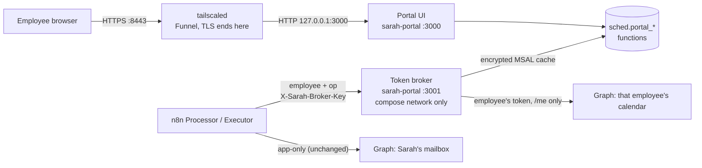

# Portal: self-service sign-in and delegated calendars

**Result:** any BZB employee in the "Sarah users" group opens `https://bzb-ai-1.tail9f1964.ts.net:8443`, signs in with Microsoft 365, connects their calendar, sets their preferences, and can CC Sarah right away. No PowerShell or SQL per person.

What changes and what doesn't:

| | Before | With the portal |
|---|---|---|
| Sarah's mail | App-only Graph credential, RBAC-scoped to Sarah's mailbox | **Unchanged** |
| An employee's calendar | App-only credential, RBAC-scoped by `CustomAttribute11` (per person, PowerShell) | The employee's **own delegated token**, used only by the portal's token broker |
| Enrolling someone | Copy Vic's `employees` row by hand | They sign in; the row is created and prefilled from Outlook |
| Vic | `calendar_auth = 'app'` | Connects at the portal like everyone else; his row becomes `delegated`. On a fresh install the app never has calendar rights, so he connects before you leave `dry_run` |



The broker never hands a token to n8n. n8n names an employee and one of three operations (`calendar_view`, `create_event`, `delete_event`); the broker calls Graph on `/me/...` with that employee's token and returns Graph's status and body unchanged (`docs/08-decisions.md`, D17). Tokens therefore never appear in n8n's execution history, and n8n can't reach any other calendar the employee happens to have access to.

## 1. Entra: the "BZB Sarah Portal" app

This is a **second, separate** app registration. Leave "BZB Scheduling Agent" exactly as it is: zero Entra permissions, mail scoped by RBAC (D4).

1. **Entra ID → App registrations → New registration**
   - Name: `BZB Sarah Portal`
   - Supported account types: **Accounts in this organizational directory only** (single tenant)
   - Redirect URI: platform **Web**, value exactly `https://bzb-ai-1.tail9f1964.ts.net:8443/auth/callback`
     (Entra requires HTTPS for a non-localhost redirect URI. It must match `PORTAL_BASE_URL` + `/auth/callback` character for character, port included.)
2. **Authentication:** leave "Access tokens" and "ID tokens" (implicit grant) **unchecked**. "Allow public client flows": **No**. The portal uses the authorization-code flow with PKCE as a confidential client.
3. **Certificates & secrets → New client secret**, 12 months. Copy the value into `portal.env` (§3). Put the expiry on your calendar (§8).
4. **API permissions → Add → Microsoft Graph → Delegated permissions:** `openid`, `profile`, `offline_access`, `User.Read`, `MailboxSettings.Read`, `Calendars.ReadWrite`. **No application permissions**, ever.
5. **Admin consent.** Check **Enterprise applications → Consent and permissions → User consent settings**:
   - If users may consent only to low-impact permissions, or not at all (the usual setting), employees can't consent to `Calendars.ReadWrite` themselves. Click **Grant admin consent for Blu Zone Bio** on the API permissions page. This is a one-time, org-wide approval of the delegated permissions. It still only ever lets the portal act on the calendar of the person who signed in.
   - If users can consent to everything, admin consent is optional, but grant it anyway, so nobody sees a consent prompt and nobody can later withdraw consent by accident. (With per-user consent, an employee who removes the app at myapps.microsoft.com triggers the reconnect flow.)
6. **Enterprise applications → BZB Sarah Portal → Properties → Assignment required: Yes.** This is mandatory: the portal is on the internet.
7. **Create the group:** Entra → Groups → New group, Security, `Sarah users`. Then **Enterprise applications → BZB Sarah Portal → Users and groups → Add user/group →** `Sarah users`.
   - To give someone Sarah: add them to `Sarah users`. They then sign in at the portal.
   - Anyone not in the group is stopped by Entra before the portal sees them (AADSTS50105). The portal shows the same generic "Sign-in didn't work" page as for any other failure.
8. Write down the **Directory (tenant) ID** (a GUID, not a domain) and the **Application (client) ID**.

On top of Entra's checks, the portal rejects any token not issued by BZB's tenant, any **guest** (a B2B guest gets BZB's `tid` but their home tenant is elsewhere, and Graph reports `userType = Guest`), and any account whose UPN or mail is outside `internal_domains`.

## 2. Database

The portal connects as its own role, which can execute the `sched.portal_*` functions and nothing else: no table access and no workflow functions.

```bash
cd /opt/bzb-ai/compose
# 1. the role (superuser; once)
docker compose exec -T postgres psql -U <superuser> -c "CREATE ROLE sched_portal LOGIN PASSWORD '<from your vault>';"
# 2. the migration (as sched_agent). Safe to re-run; re-run it whenever you create the role after the fact,
#    because the grants apply only if the role exists.
docker compose exec -T postgres psql -v ON_ERROR_STOP=1 -U sched_agent -d sched_agent < /opt/bzb-ai/sarah/db/004_portal.sql
# 3. self-test (both files roll back; every line should say PASS)
for t in db_tests portal_tests; do
  docker compose exec -T postgres psql -U sched_agent -d sched_agent -t -A < /opt/bzb-ai/sarah/db/tests/$t.sql | grep -v '^$'
done
```

`004` is additive: Vic's row keeps `calendar_auth = 'app'`, and nothing changes until someone connects. See `docs/03-database.md` for the new settings and columns.

## 3. Deploy the portal

The repo is checked out at `/opt/bzb-ai/sarah` on BZB-AI-1.

1. Create `/opt/bzb-ai/compose/portal.env` (`chmod 600`, never in git):

   ```bash
   ENTRA_TENANT_ID=<directory (tenant) id>
   ENTRA_CLIENT_ID=<BZB Sarah Portal application (client) id>
   ENTRA_CLIENT_SECRET=<secret value>
   PORTAL_TOKEN_KEYS=k1:<openssl rand -base64 32>
   PORTAL_SESSION_SECRET=<openssl rand -base64 32>
   PORTAL_BROKER_KEY=<openssl rand -hex 32>
   PGPASSWORD=<sched_portal password>
   ```

   Put `PORTAL_TOKEN_KEYS` in your vault as well. If it's lost, every stored token is unreadable and every employee has to reconnect.
2. Merge `deploy/compose.portal.yml` into the stack's compose file (fix `PGHOST` to the Postgres service name), then:

   ```bash
   docker compose build sarah-portal && docker compose up -d sarah-portal
   docker compose logs sarah-portal | tail -3          # expect "portal_started"
   curl -s -o /dev/null -w '%{http_code}\n' http://127.0.0.1:3000/login     # 200
   curl -s -m 3 http://127.0.0.1:3001/internal/v1/health || echo "3001 not published: correct"
   ```

3. **n8n:** add the fourth credential (`docs/04-n8n-setup.md` §2), **Sarah · Portal broker key** (`SchedPortalKey01`): header `X-Sarah-Broker-Key`, value = `PORTAL_BROKER_KEY`. Re-import and publish the workflows (§3 there).
4. **Settings** (`docs/03-database.md`): `portal_base_url` = the public URL, used in emails; `portal_internal_url` = `http://sarah-portal:3001`; optionally `portal_admins`.
5. Serve it with Funnel (§4), then sign in yourself first.

### Environment variables

| Variable | Required | Meaning |
|---|---|---|
| `PORTAL_BASE_URL` | yes | The public origin, `https://bzb-ai-1.tail9f1964.ts.net:8443`. HTTPS, no path. **Every** absolute URL (redirects, the OAuth redirect URI) is built from this, never from request headers |
| `ENTRA_TENANT_ID` | yes | Tenant GUID. Sign-in uses the single-tenant authority `https://login.microsoftonline.com/<tenant>` |
| `ENTRA_CLIENT_ID`, `ENTRA_CLIENT_SECRET` | yes | The BZB Sarah Portal app |
| `PORTAL_TOKEN_KEYS` | yes | `id:base64key[,id:base64key…]`, 32-byte AES-256-GCM keys. The first encrypts; all decrypt (§8) |
| `PORTAL_SESSION_SECRET` | yes | ≥ 32 random bytes, base64. Encrypts the short-lived sign-in state cookie |
| `PORTAL_BROKER_KEY` | yes | ≥ 32 chars. The shared secret n8n sends to the broker |
| `PGHOST` `PGDATABASE` `PGUSER` `PGPASSWORD` (or `DATABASE_URL`) | yes | Connects as `sched_portal` |
| `PORTAL_PORT` / `PORTAL_BROKER_PORT` | no | 3000 / 3001 |
| `PORTAL_SESSION_HOURS` | no | Session length, default 12 |
| `PORTAL_RATE_LIMIT_MAX`, `PORTAL_RATE_LIMIT_WINDOW_S` | no | Sign-in attempts per window per socket address, default 30 per 300 s (§4) |
| `PORTAL_KEEPALIVE_HOURS` | no | Token refresh interval, default 24 |
| `GRAPH_BASE_URL`, `ENTRA_AUTHORITY_HOST` | no | Only for tests |
| `PORTAL_ALLOW_INSECURE_LOCALHOST=1` | no | Local development only: allows `http://localhost` as the base URL. Never in production |

## 4. Serving with Tailscale Funnel

Open WebUI already uses Funnel on 443, and Funnel only allows ports 443, 8443 and 10000, so the portal gets **8443**. The portal runs at the root path.

```bash
# serve AND expose publicly, in one command (current CLI syntax)
sudo tailscale funnel --bg --https=8443 http://127.0.0.1:3000

# check: exactly two public entries, Open WebUI on 443 and the portal on 8443 → 127.0.0.1:3000
tailscale funnel status
```

`tailscale funnel status` must show `https://bzb-ai-1.tail9f1964.ts.net` (Open WebUI) and `https://bzb-ai-1.tail9f1964.ts.net:8443` → `http://127.0.0.1:3000`, both marked **Funnel on**, and nothing else. 3001 must never appear.

Don't use `tailscale funnel --bg 8443`. A bare number is read as the *local target port*, served on the default HTTPS port, so that command would point the public 443 (Open WebUI's) at `localhost:8443`.

**Turn the portal off** (Open WebUI's 443 is untouched):

```bash
sudo tailscale funnel --https=8443 off
```

Don't use `tailscale serve reset`: it removes Open WebUI's config as well. With the portal off, nobody can sign in or connect. Sarah keeps running, because the broker is internal and unaffected.

### What the app assumes behind Funnel

- **TLS terminates at tailscaled.** The portal receives plain HTTP from a local address. It therefore never looks at `Host`, `X-Forwarded-Host`, `X-Forwarded-Proto`, `X-Forwarded-For` or `Forwarded`. Every redirect, every link in an email and the OAuth redirect URI are built from `PORTAL_BASE_URL`, and there is no "trust proxy" setting. The tests send spoofed headers and check that nothing follows them.
- **Cookies are always `Secure`**, whatever scheme the request appears to use.
- **Only the UI port is published,** as `127.0.0.1:3000:3000`. The broker port 3001 is reachable only on the compose network as `http://sarah-portal:3001`. The public server doesn't route `/internal/...` at all, even with the right key; unauthenticated, it's just another redirect to `/login`.
- **Cookies are per host, not per port,** so the portal shares a cookie jar with Open WebUI. The portal sets and reads only `__Host-sarah_session` and `__Host-sarah_auth`. The `__Host-` prefix makes the browser require `Secure`, `Path=/` and no `Domain`, so the cookies are bound to this exact host. The `sarah_` names can't collide with Open WebUI's cookies, and every other cookie in the jar is ignored. Both are `HttpOnly; SameSite=Lax`, and every POST also needs the session's CSRF token, plus a matching `Origin` when the browser sends one.
- **Security headers on every response:**
  - `Strict-Transport-Security: max-age=31536000`
  - `Content-Security-Policy: default-src 'none'; style-src 'self'; img-src 'self'; form-action 'self' https://login.microsoftonline.com; frame-ancestors 'none'; base-uri 'none'`. The portal has no JavaScript at all.
  - `X-Frame-Options: DENY`, `X-Content-Type-Options: nosniff`, `Referrer-Policy: no-referrer`
- **Before sign-in,** only `/login`, the sign-in callback (which needs a valid in-flight sign-in cookie) and `/static/portal.css` respond. Everything else redirects to `/login`. The admin page also requires the UPN to be `alert_address` or in `portal_admins`; for anyone else it returns 404.
- **Errors are generic.** Every unauthenticated failure (wrong tenant, guest, not in the group, bad state, Entra error, rate limit) shows the same page. Nothing about why reaches the browser, and neither does any token, the broker key or MSAL error text. The reason goes to the portal's log as a code.
- **Rate limits** apply to `/login` and `/auth/callback`, per **socket address**, never a header. Behind Funnel plus Docker, every public request arrives from the same local address (the Docker gateway), so in practice the limit (30 per 5 minutes per route) caps sign-in attempts for the whole portal. A flood can therefore lock everyone out of *signing in* for a few minutes. Signed-in sessions and Sarah herself are unaffected. That's the accepted trade-off for not trusting forwarded headers.

### Assume it will be found

Funnel's certificate is public, and `*.ts.net` hostnames appear in certificate-transparency logs. Anyone can learn `bzb-ai-1.tail9f1964.ts.net` exists and probe `:8443`. The design assumes this:
- "Assignment required" plus the "Sarah users" group means only BZB members can even complete sign-in.
- No unauthenticated page leaks anything.
- The broker isn't exposed.
- The portal holds no secrets in its pages.

### Moving to a branded domain later

To serve it as, say, `https://sarah.bluzonebio.com`:
1. In the Entra app, add the new redirect URI `https://sarah.bluzonebio.com/auth/callback`. Keep the old one until the switch is done.
2. Change `PORTAL_BASE_URL` in `portal.env`, and the `portal_base_url` setting, then restart the portal. Links in emails sent before the switch still point at the old host.
3. Put the new front end (reverse proxy with its own certificate) in front of `127.0.0.1:3000`.
4. Then `sudo tailscale funnel --https=8443 off`, and remove the old redirect URI from Entra.
5. Sessions don't carry over (cookies are bound to the host), so everyone signs in once more. Stored calendar tokens are unaffected.

## 5. Using it

| Page | Does |
|---|---|
| Sign in | Microsoft sign-in (only `User.Read`). Creates the employee's row on first sign-in, or attaches to an existing row with the same UPN/mail (Vic's) |
| Connect calendar | The consent step (`Calendars.ReadWrite`, `MailboxSettings.Read`, `offline_access`). A test calendar read proves the grant works before tokens are stored. On first connect, timezone and working hours are copied from Outlook (Windows timezone names are converted to IANA). The employee's `calendar_auth` becomes `delegated` |
| Settings | Everything in `sched.employees` an employee should own, validated with the same limits as the database |
| How to use Sarah | The one-pager |
| My threads | The employee's own threads from `sched.status` |
| Pause / resume | Paused: new requests from them are ignored, and Sarah tells them so. Running threads continue (D18) |
| Send me a test | Queues an internal email through the outbox. In `off` or `dry_run` the page says it won't be sent |
| Admin | Every employee: calendar mode, token health, last refresh and error code, paused, last sign-in, last activity, open threads |

## 6. Failure modes

| Case | What happens |
|---|---|
| Refresh token unused for 90 days | Prevented: the portal refreshes every connected employee's token daily |
| Token revoked (admin "revoke sessions", Conditional Access requires sign-in again, consent withdrawn) | The next refresh fails with an AADSTS code, and the employee is flagged `needs_reconnect`. **One** email with the reconnect link goes out through the outbox, only on the change, never repeatedly. New requests from them are ignored with a "reconnect your calendar" notice. A running thread that needs the calendar goes to `NEEDS_VIC` with a specific reason, the client gets nothing, and Casey isn't alerted (not a system fault). Hold releases wait (no calls while the token is dead) and run by themselves once they reconnect. A password change alone doesn't revoke a confidential client's refresh token |
| Account disabled or deleted (left BZB) | Recognized from the error code (AADSTS50057 / 50034): no email to the dead mailbox. Casey is alerted with their open threads. Follow the offboarding steps in `docs/07-runbook.md` |
| The portal's own secret expired or invalid (AADSTS7000222 / 7000215 …) | Treated as a portal problem: 503, nobody is flagged and nobody is emailed. Calendar reads escalate like any Graph error and Casey sees `token_unavailable … app_problem` in the portal log. Rotate the secret (§8) |
| Entra or Graph unreachable | 503 / Graph's error. The executor retries 3×, and the processor escalates like any calendar error |
| Portal down | Same as above for delegated employees. App-only employees (Vic before he connects) are unaffected |
| Encryption key lost | Every employee must reconnect. Keep `PORTAL_TOKEN_KEYS` in the vault |

## 7. Connecting Vic

Vic's row comes from `db/003_seed.sql` with `calendar_auth = 'app'`. On a fresh install (`docs/02-m365-setup.md`) the app has no calendar rights, so until Vic connects, Sarah can't read his calendar.

1. Vic signs in and connects (two clicks), before you leave `dry_run`. His row flips to `delegated`, and the admin page shows "OK".
2. Only if you used the optional app-only calendar step in `docs/02-m365-setup.md`: undo it now, with the commands there. The app-only secret then touches nothing but Sarah's mailbox.

## 8. Rotating secrets

**Token encryption key** (`PORTAL_TOKEN_KEYS`):
1. Generate `openssl rand -base64 32` and put it **first**: `PORTAL_TOKEN_KEYS=k2:<new>,k1:<old>`. Restart the portal.
2. Re-encrypt every stored cache: `docker compose exec sarah-portal node bin/rotate-keys.js` (prints counts only).
3. Remove `k1`, restart. If step 2 reported failures, those employees must reconnect.

**Client secret** (yearly): create a new secret in the Entra app, update `ENTRA_CLIENT_SECRET`, restart, watch the admin page's "Last token refresh" on the next keep-alive (or sign in yourself), then delete the old secret.

**Broker key:** set the new value in `portal.env` and in the n8n credential at the same time, then restart the portal. Calendar calls fail with 401 for the few seconds in between, and the executor retries.

**Session secret:** change and restart. Only in-flight sign-ins (under 10 minutes old) are affected.

## 9. To verify against the tenant

- [ ] User consent setting → admin consent granted (§1.5)
- [ ] Conditional Access policies that target all cloud apps: a **sign-in frequency** policy would expire every employee's portal token on that schedule (each would get a reconnect email). Exclude BZB Sarah Portal from sign-in frequency, or accept the cadence
- [ ] UPN equals primary SMTP for every employee. If not, the portal stores the mail address for matching, but check the first few rows on the admin page
- [ ] Guest accounts exist? (They're rejected; this just tells you whether you'll get "why can't I sign in" questions)
- [ ] `tailscale funnel status` shows only 443 (Open WebUI) and 8443 → 127.0.0.1:3000
